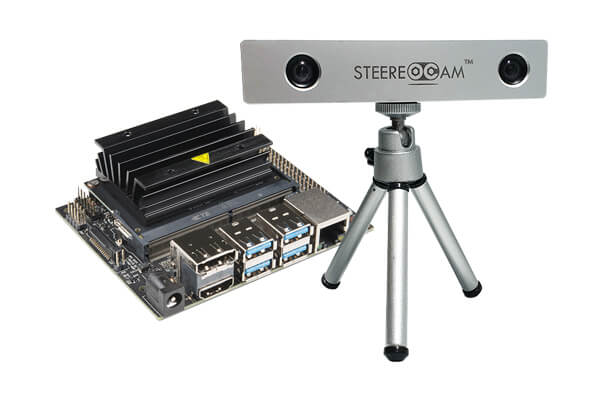
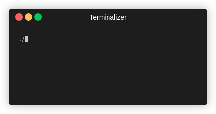
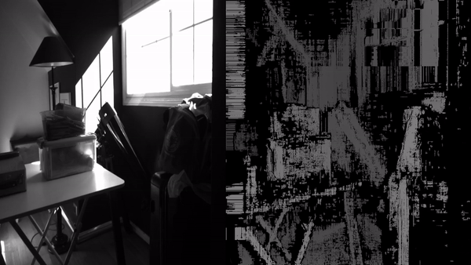
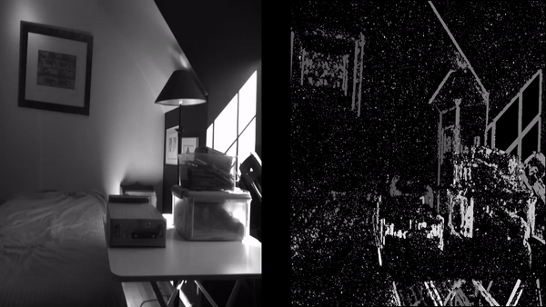
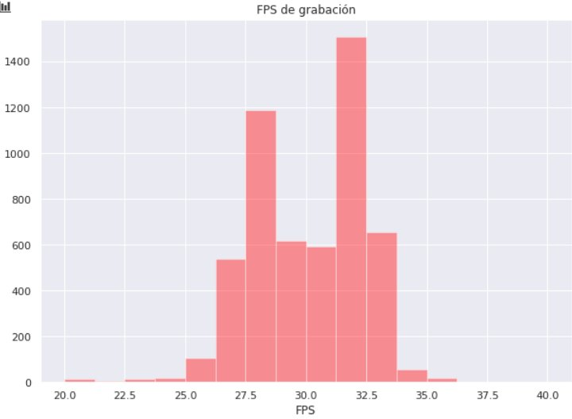
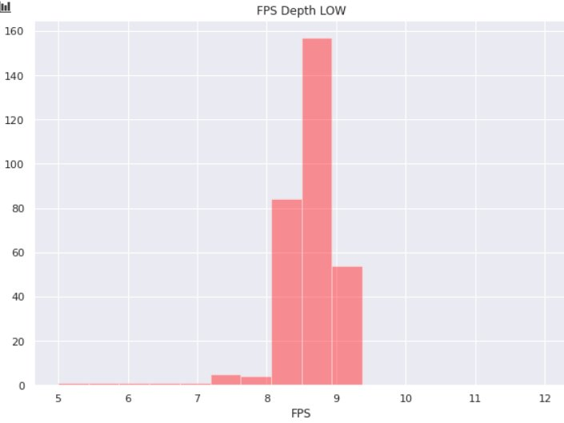
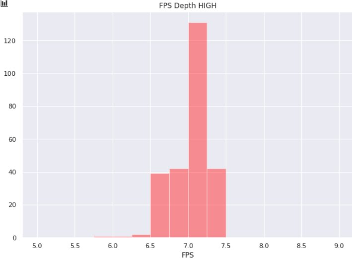
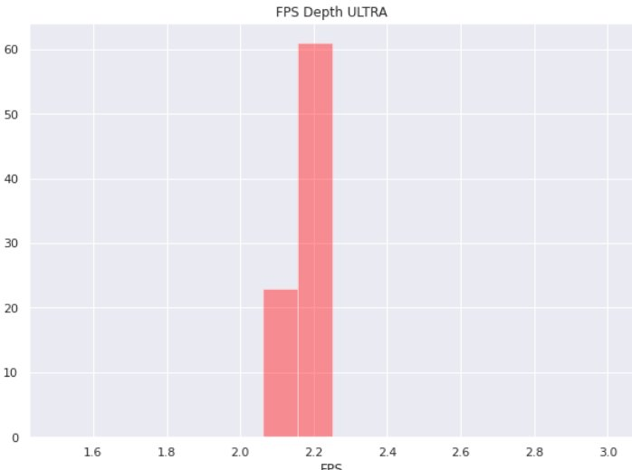

# Cámara Estéreo E-CAM20
En este repositorio se podrá encontrar información relevante acerca del uso de la cámara estéreo STEEREOCAM de **e-con systems**.

<center>

</center>

# Tabla de contenidos
- [Cámara Estéreo E-CAM20](#cámara-estéreo-e-cam20)
- [Tabla de contenidos](#tabla-de-contenidos)
- [Descripción Dispositivo](#descripción-dispositivo)
- [Documentación](#documentación)
- [Módulos](#módulos)
  - [Procesamiento básico con cámara estéreo](#procesamiento-básico-con-cámara-estéreo)
    - [**Instrucciones de instalación**](#instrucciones-de-instalación)
  - [Captura de video](#captura-de-video)
    - [**Instrucciones de instalación**](#instrucciones-de-instalación-1)
    - [**Instrucciones de uso**](#instrucciones-de-uso)
- [Benchmarks](#benchmarks)
  - [Instrucciones de instalación](#instrucciones-de-instalación-2)
  - [Instrucciones de uso](#instrucciones-de-uso-1)
    - [**Benchmark FPS**](#benchmark-fps)
    - [**Benchmark SDK Depth Map**](#benchmark-sdk-depth-map)
    - [**Benchmark OpenCV Disparity Map**](#benchmark-opencv-disparity-map)
  - [Resultados](#resultados)
    - [**Comparación**](#comparación)
    - [**Histogramas**](#histogramas)

# Descripción Dispositivo
E-CAM20 (STEEREOCAM) es un dispositivo de visión estéreo diseñado por e-con systems para ser utilizado con el kit de desarrollo de Jetson Nano o Jetson Xavier y está compuesto por dos sensores ópticos OV2311 con resolución 1300x1600 a 30fps monocromático con interfaz MIPI para una transferencia de alta velocidad, una IMU integrada y un adaptador para camaras CSI.

# Documentación

La siguiente lista muestra la documentación disponible para el uso de la cámara:

- **instructivo_de_uso_ecam20.pdf**: Corresponde a un instructivo en donde se explica como montar la cámara estéreo e-cam20 en la Jetson Nano e instalar los software y dependencias necesarias para poder utilizar el dispositivo.

- **datasheet_cam.pdf**: Datasheet de la cámara estéreo.

- **datasheet_lens.pdf**: Datasheet de los lentes de la cámara estéreo.

- **TaraXL_API.pdf**: Descripción de la API del **SDK** para utilizar la cámara estéreo en C++.

# Módulos
A continuación se muestran los módulos disponibles que pueden ser utilizados junto al dispositivo.

## Procesamiento básico con cámara estéreo

Este módulo obtiene imágenes de ambos lentes de la cámara utilizando el **SDK** para ser procesado por filtros básicos, se encuentra implementado en `basic_imgproc`.

### **Instrucciones de instalación**
 luego de haber completado el instructivo `instructivo_de_uso_ecam20.pdf`, se debe clonar el repositorio a la jetson de destino y compilar el programa, ejecutando los siguientes comandos:

```
$ git clone https://github.com/tomaspoupin/lineas_de_fondeo.git
$ cd lineas_de_fondeo/dispositivos/e-cam20/basic_imgproc
$ mkdir build -p && cd build
$ cmake ..
$ make
```

Luego para utilizar, simplemente se debe ejecutar el binario resultante.

```
$ ./basic_stereo
```

## Captura de video
El módulo de captura de video permite grabar en tiempo real utilizando la cámara estéreo, su implementación se encuentra en `video_capture`. La salida del programa es un video `.mkv` que muestra ambos lentes de la cámara teniendo como formatos posibles de grabación:

- 1280 x 720 (HD)
- 640 x 480 (SD)

### **Instrucciones de instalación**

1. Dentro del terminal de la Jetson Nano, clonar el repositorio y entrar a la carpeta del módulo.

```
$ git clone https://github.com/tomaspoupin/lineas_de_fondeo.git
$ cd lineas_de_fondeo/dispositivos/e-cam20/video_capture
```

2. Compilar el programa.

```
$ mkdir build -p && cd build
$ cmake ..
$ make
```

3. Ejecutar el programa.

```
$ ./video_capture
```

### **Instrucciones de uso**

Al ejecutar el programa se debe seleccionar el formato de grabación:

- `0`: Grabación HD
- `1`: Grabación SD
  
Luego para finalizar la grabación, se debe presionar la tecla `f`.



# Benchmarks

Para medir el desempeño de la cámara se generaron una serie de pruebas de rendimiento, su implementación se encuentra en `benchmarks`, los benchmarks disponibles son los siguientes:

- **Benchmark FPS**: Benchmark que mide la cantidad fps obtenidas al grabar normalmente con la cámara estéreo.
- **Benchmark SDK Depth Map**: Mide la cantidad de fps obtenidos al obtener en tiempo real mapas de profundidad y disparidad utilizando el **SDK** De la cámara.
- **Benchmark OpenCV Disparity Map**: Mide la cantidad de fps a partir de la obtención continua de mapas de disparidad mediante la API de OpenCV.

## Instrucciones de instalación

1. Dentro del terminal de la Jetson Nano, clonar el repositorio y entrar a la carpeta `benchmarks`.

```
$ git clone https://github.com/tomaspoupin/lineas_de_fondeo.git
$ cd lineas_de_fondeo/dispositivos/e-cam20/benchmarks
```

2. Compilar el programa.

```
$ mkdir build -p && cd build
$ cmake ..
$ make
```

Dentro del directorio `benchmarks` debiese aparecer un directorio llamado `bin` con los siguientes ejecutables:

- `benchmark_fps`
- `benchmark_depth_sdk`
- `benchmark_disparity_opencv`

A continuación se explica el uso de cada uno de los ejecutables.

## Instrucciones de uso
Para cada uno de los programas se debe estár dentro de la carpeta `benchmarks/bin`. Al finalizar la ejecución los resultados son exportados al directorio `benchmarks/bin/report/<nombre de benchmark>`.
### **Benchmark FPS**

El formato de ejecución del programa es el siguiente:

```
$ ./benchmark_fps <time_in_seconds>
```

Donde `time_in_seconds` es el tiempo de ejecución del benchmark en segundos. Por ejemplo, para ejecutar el benchmark durante 60 segundos, ejecutamos:

```
$ ./benchmark_fps 60
```

En consola, debiese aparecer un resultado similar al siguientes:

```
Cámara iniciada correctamente.
Realizando medición de fps durante 60 segundos.
FPS Promedio: 7.03339
Escribiendo resultados.
Resultados escritos satisfactoriamente.
```

### **Benchmark SDK Depth Map**

El formato de ejecución del programa es el siguiente:

```
$ ./benchmark_depth_sdk <time> <depth_accuracy>
```

Donde `time` es el tiempo de ejecución en segundos y `depth_accuracy` es el nivel de precisión para obtener los mapas de profundidad, los valores posibles para `depth_accuracy` son:

- `0`: Precisión Baja
- `1`: Precisión Alta
- `2`: Precisión Ultra

Cómo ejemplo, para ejecutar durante 30 segundos en precisión alta escribimos:

```
$ ./benchmark_depth_sdk 30 1
```

### **Benchmark OpenCV Disparity Map**

El formato de ejecución del programa es el siguiente:

```
$ ./benchmark_disparity_opencv <time> <disp> <block>
```

Donde `time` es el tiempo de ejecución en segundos, `disp` es el nivel número de disparidades el cual debe ser múltiplo de 16, `block` es el tamaño de bloque de comparación, el cual debe ser un numero impar.

Cómo ejemplo, para ejecutar durante 30 segundos con disparidad de 64 y tamaño de bloque de 9, ejecutamos:

```
$ ./benchmark_disparity_opencv 30 64 9
```
## Resultados

Precisión Alta            |  Precisión Ultra
:-------------------------:|:-------------------------:
  |  

Precisión Baja            |  OpenCV
:-------------------------:|:-------------------------:
  |  

### **Comparación**

A continuación se muestra una comparativa entre los resultados obtenidos y las especificaciones del fabricante.

|                            | Especificación | Observado |
|:--------------------------:|:--------------:|:---------:|
|          FPS Bruto         |     30 FPS     |  30.0215  |
|  FPS Generación Mapas LOW  |     10 FPS     |   8.5550  |
|  FPS Generación Mapas HIGH |        -       |   7.0337  |
| FPS Generación Mapas ULTRA |        -       |   2.1800  |

### **Histogramas**

1. FPS Bruto



2. FPS Depth LOW
   


3. FPS Depth HIGH
   


4. FPS Depth ULTRA
   
