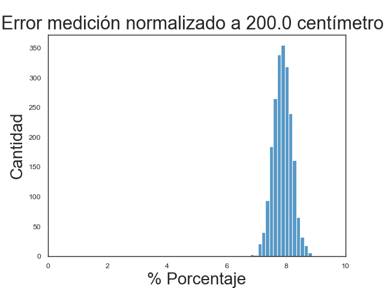
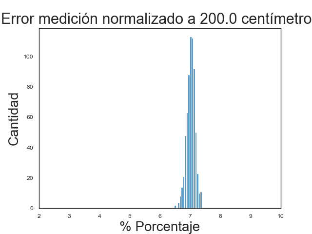
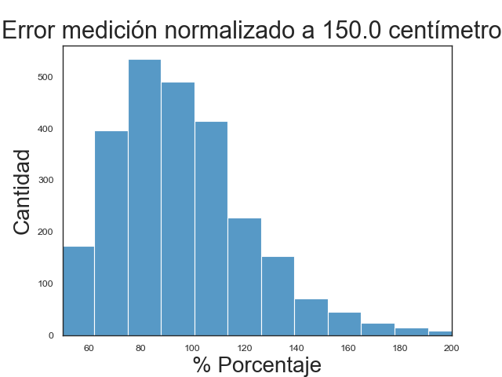
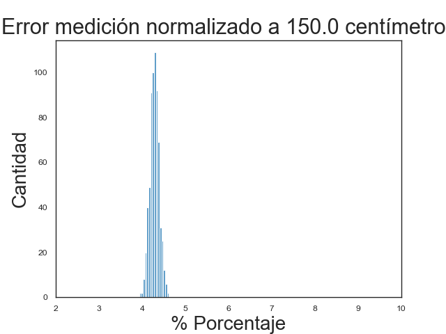

# Cámara Estéreo E-CAM20
En este repositorio se podrá encontrar información relevante acerca del uso de la cámara estéreo STEEREOCAM de **e-con systems**.

<center>

</center>

# Tabla de contenidos
- [Cámara Estéreo E-CAM20](#cámara-estéreo-e-cam20)
- [Tabla de contenidos](#tabla-de-contenidos)
- [Descripción Dispositivo](#descripción-dispositivo)
- [Documentación](#documentación)
- [Módulos](#módulos)
  - [Instrucciones de instalación](#instrucciones-de-instalación)
  - [Procesamiento básico con cámara estéreo](#procesamiento-básico-con-cámara-estéreo)
    - [**Instrucciones de uso**](#instrucciones-de-uso)
  - [Captura de video](#captura-de-video)
    - [**Instrucciones de uso**](#instrucciones-de-uso-1)
  - [Scripts](#scripts)
    - [Instrucciones de uso](#instrucciones-de-uso-2)
  - [Benchmarks de velocidad](#benchmarks-de-velocidad)
    - [Instrucciones de uso](#instrucciones-de-uso-3)
    - [**Benchmark FPS**](#benchmark-fps)
    - [**Benchmark SDK Depth Map**](#benchmark-sdk-depth-map)
    - [**Benchmark OpenCV Disparity Map**](#benchmark-opencv-disparity-map)
  - [Medición de precisión](#medición-de-precisión)
    - [Instrucciones de uso](#instrucciones-de-uso-4)
- [Resultados](#resultados)
    - [**Comparación de Velocidad**](#comparación-de-velocidad)
    - [**Tabla de resultados medición de profundidad**](#tabla-de-resultados-medición-de-profundidad)
    - [**Histogramas**](#histogramas)

# Descripción Dispositivo
E-CAM20 (STEEREOCAM) es un dispositivo de visión estéreo diseñado por e-con systems para ser utilizado con el kit de desarrollo de Jetson Nano o Jetson Xavier y está compuesto por dos sensores ópticos OV2311 con resolución 1300x1600 a 30fps monocromático con interfaz MIPI para una transferencia de alta velocidad, una IMU integrada y un adaptador para camaras CSI.

# Documentación

La siguiente lista muestra la documentación disponible para el uso de la cámara:

- **[Instructivo de uso](instructivo_de_uso_ecam20.pdf)**: Corresponde a un instructivo en donde se explica como montar la cámara estéreo e-cam20 en la Jetson Nano e instalar los software y dependencias necesarias para poder utilizar el dispositivo.

- **[Datasheet cámara](datasheet_cam.pdf)**: Datasheet de la cámara estéreo.

- **[Datasheet lentes](datasheet_lens.pdf)**: Datasheet de los lentes de la cámara estéreo.

- **[Documentación API](TaraXL_API.pdf)**: Descripción de la API del **SDK** para utilizar la cámara estéreo en C++.

# Módulos
A continuación se muestra una lista de los modulos disponibles:

- **Procesamiento básico**: Implementado en `basic_imgproc`, obtiene una imagen estéreo de la cámara y le aplica filtros básicos.
- **Captura de video**: Implementado en `video_capture`, permite grabar video en HD o SD utilizando la cámara estéreo.
- **Benchmarks de FPS**: Implementado en `fps_benchmarks`, Conjunto de benchmarks para medir la velocidad en fps con la cual se pueden ejecutar
diferentes rutinas de la cámara.
- **Scripts**: Implementado en `scripts`, contiene una variedad de scripts de utilidad cómo obtener los parámetros de la cámara o imprimir información
respecto a la cámara.
- **Precisión de cámara**: Implementado en `depth_precision`, consiste en un benchmark para medir la precisión de la cámara para medir la profundidad.

## Instrucciones de instalación

Para realizar la instalación de uno o varios módulos, primero se debe clonar el repositorio.

```
$ git clone https://github.com/tomaspoupin/SteereoCAM.git
```

Luego, se entrar dentro del repositorio y se debe crear un directorio para construir los módulos y entrar a dicha carpeta.

```
$ cd SteereoCAM
$ mkdir -p build && cd build
```

Por defecto, el repositorio está configurado para que ningún módulo sea compilado, por lo que para configurar la compilación de todos los módulos del repositorio se debe ejecutar lo siguiente:

```
$ cmake -DBASIC_IMGPROC=ON \
        -DVIDEO_CAPTURE=ON \
        -DFPS_BENCHMARKS=ON \
        -DSCRIPTS=ON \
        -DDEPTH_PRECISION=ON ..
```

Si se desea configurar sólamente un modulo en específico, se debe ejecutar:

```
$ cmake -D<Modulo>=ON ..
```

Donde `<Modulo>` puede tener los siguientes valores:

- `BASIC_IMGPROC`: Módulo de procesamiento básico de imágen estéreo.
- `VIDEO_CAPTURE`: Módulo de captura de video.
- `FPS_BENCHMARKS`: Módulo de benchmarks de fps.
- `SCRIPTS`: Módulo de scripts de utilidad.
- `DEPTH_PRECISION`: Módulo de benchmark de precisión.

Finalmente, para compilar los módulos seleccionados, ejecutar:

```
$ make
```

Los ejecutables resultantes estarán disponibles en el directorio `build/bin` generado luego de la compilación. A continuación se muestra la descripción de cada módulo en específico.

## Procesamiento básico con cámara estéreo

Este módulo obtiene imágenes de ambos lentes de la cámara utilizando el **SDK** para ser procesado por filtros básicos, se encuentra implementado en `basic_imgproc`.

### **Instrucciones de uso**

Para utilizar, simplemente se debe ejecutar el binario que se encuentra dentro de `build/bin`, utilizando el siguiente comando:

```
$ ./basic_stereo
```

## Captura de video
El módulo de captura de video permite grabar en tiempo real utilizando la cámara estéreo, su implementación se encuentra en `video_capture`. La salida del programa es un video `.mkv` que muestra ambos lentes de la cámara teniendo como formatos posibles de grabación:

- 1280 x 720 (HD)
- 640 x 480 (SD)


### **Instrucciones de uso**

Dentro de la carpeta `build/bin`, ejecutar:

```
./video_capture
```

La sinopsis del programa es el siguiente:

```
video_capture [OPTION]
[OPTION]: [-v], [--verbose]
```

`-v` o `--verbose` es opcional y entrega información adicional en pantalla para fines de depuración.
Al ejecutar el programa se debe seleccionar el formato de grabación:

- `0`: Grabación HD
- `1`: Grabación SD
  
Luego para finalizar la grabación, se debe presionar la tecla `f`.


## Scripts
El módulo scripts implementado en `scripts` contiene los siguientes ejecutables en la carpeta `build/bin`:

- **print_depth_info**: Script que imprime en pantalla información sobre tipo y formato de las imágenes estéreo, los mapas de disparidad y de profundidad.
- **export_cam_params**: Script que exporta en formato `YML` parámetros de la cámara estéreo tales como los parámetros intrínsecos, distancia focal, entre otros. El archivo `YML` resultante es compatible con la clase `cv::FileStorage`.

### Instrucciones de uso

Dentro de la carpeta en donde se encuentra los scripts, ejecutar:

```
$ ./print_depth_info
$ ./export_cam_params
```

## Benchmarks de velocidad

Para medir el desempeño de la cámara se generaron una serie de pruebas de rendimiento, su implementación se encuentra en `fps_benchmarks`, los benchmarks disponibles son los siguientes:

- **Benchmark FPS**: Benchmark que mide la velocidad con la cual el dispositivo es capaz de adquirir un frame de ambos lentes de la cámara.
    
  - Parámetros:

    - Tiempo de ejecución: el tiempo que se ejecuta el benchmark en segundos.
  
  - Variable medida: Tiempo de ejecución en `ms` de función `TaraXlCam.grabFrame` (vease [documentación API](instructivo_de_uso_ecam20.pdf)).

  - Resultados:

    - Archivo `.csv` el cual contiene una lista de las mediciones realizadas en `fps`. 

- **Benchmark SDK Disp Depth Map**: Benchmark que mide la velocidad con la cual el dispositivo es capaz de obtener un un mapa de profundidad, un mapa de disparidad y un frame de ambos lentes.

  - Parámetros:

    - Tiempo de ejecución: el tiempo que se ejecuta el benchmark en segundos.
    - Nivel de precisión: Cantidad de procesamiento realizado, tiene tres niveles: **LOW**, **HIGH** y **ULTRA**. **LOW** implica mayor FPS, menor precisión, con un rango útil de 145[cm] a 8[m] y 64 niveles de disparidad. **HIGH** implica menor FPS, mayor precisión, con un rango útil de 95[cm] a 8[m] y 128 niveles de disparidad. **ULTRA** implica FPS muy reducidos, mayor precisión con un rango útil de 115[cm] a 8[m] y 128 niveles de disparidad.
  
  - Variable medida: Tiempo de ejecución en `ms` de función `TaraXlDepth.getMap` (vease [documentación API](instructivo_de_uso_ecam20.pdf)).

  - Resultados:

    - Archivo `.csv` el cual contiene una lista de las mediciones realizadas en `fps`.
    - Video en formato `.mkv` que contiene mapas de disparidad obtenidas durante el benchmark.
    - Video en formato `.mkv` que contiene mapas de profundidad obtenidas durante el benchmark.
    - 2 Videos en formato `.mkv` que contiene las imágenes obtenidas del lente izquierdo y derecho.

- **Benchmark OpenCV Disparity Map**: Mide la velocidad con la cual el dispositivo es capaz de obtener mapas de disparidad, utilizando la API de OpenCV.

  - Parámetros:

    - Tiempo de ejecución: el tiempo que se ejecuta el benchmark en segundos.
    - Numero de disparidades: El rango de busqueda de disparidades, debe ser un múltiplo de **16**.
    - Tamaño de bloque: El tamaño de bloque con el cual se comparan las imagenes para realizar matching, debe ser un numero **impar**.
  
  - Variable medida: Tiempo de ejecución en `ms` de función `cv::StereoBM::compute` (vease [documentación](https://docs.opencv.org/3.4/d2/d6e/classcv_1_1StereoMatcher.html#a03f7087df1b2c618462eb98898841345)).

  - Resultados:

    - Archivo `.csv` el cual contiene una lista de las mediciones realizadas en `fps`.
    - Video en formato `.mkv` que contiene mapas de disparidad obtenidas durante el benchmark.
    - 2 Videos en formato `.mkv` que contiene las imágenes obtenidas del lente izquierdo y derecho.

### Instrucciones de uso

Dentro del directorio `build/bin` aparecerán los siguientes ejecutables:

- `benchmark_fps`
- `benchmark_depth_sdk`
- `benchmark_disparity_opencv`

Al finalizar la ejecución de cualquiera de los 3 binarios, los resultados son exportados al directorio `report/<nombre de benchmark>`.

### **Benchmark FPS**

El formato de ejecución del programa es el siguiente:

```
$ ./benchmark_fps <time_in_seconds>
```

Donde `time_in_seconds` es el tiempo de ejecución del benchmark en segundos. Por ejemplo, para ejecutar el benchmark durante 60 segundos, se ejecuta:

```
$ ./benchmark_fps 60
```

En consola, debiese aparecer un resultado similar al siguientes:

```
Cámara iniciada correctamente.
Realizando medición de fps durante 60 segundos.
FPS Promedio: 7.03339
Escribiendo resultados.
Resultados escritos satisfactoriamente.
```

### **Benchmark SDK Depth Map**

El formato de ejecución del programa es el siguiente:

```
$ ./benchmark_depth_sdk <time> <depth_accuracy>
```

Donde `time` es el tiempo de ejecución en segundos y `depth_accuracy` es el nivel de precisión para obtener los mapas de profundidad, los valores posibles para `depth_accuracy` son:

- `0`: Precisión Baja
- `1`: Precisión Alta
- `2`: Precisión Ultra

Cómo ejemplo, para ejecutar durante 30 segundos en precisión alta se escribe:

```
$ ./benchmark_depth_sdk 30 1
```

### **Benchmark OpenCV Disparity Map**

El formato de ejecución del programa es el siguiente:

```
$ ./benchmark_disparity_opencv <time> <disp> <block>
```

Donde `time` es el tiempo de ejecución en segundos, `disp` es el número de disparidades el cual debe ser múltiplo de 16, `block` es el tamaño de bloque de comparación, el cual debe ser un numero impar.

Cómo ejemplo, para ejecutar durante 30 segundos con disparidad de 64 y tamaño de bloque de 9, se ejecuta:

```
$ ./benchmark_disparity_opencv 30 64 9
```

## Medición de precisión
La implementación del benchmark se encuentra en `depth_precision`. Para observar la precisión con la cual la cámara es capaz de medir la profundidad, se montó un entorno donde la cámara mira hacia la pared a diferentes distancias, luego se obtienen mapas de disparidad durante 5 minutos midiendo sobre un cuadrado de 100x100 pixeles utilizando los diferentes modos de la cámara. El resultado del benchmark es un archivo csv con las mediciones de distancia obtenidas en centímetros.

### Instrucciones de uso

El formato de ejecución del programa es el siguiente:

```
$ ./depth_measurements <time> <depth_accuracy>
```

Donde `time` es el tiempo de ejecución en segundos y `depth_accuracy` es el nivel de precisión para obtener los mapas de profundidad, los valores posibles para `depth_accuracy` son:

- `0`: Precisión Baja
- `1`: Precisión Alta
- `2`: Precisión Ultra

# Resultados

Precisión Alta            |  Precisión Ultra
:-------------------------:|:-------------------------:
  |  

Precisión Baja            |  OpenCV
:-------------------------:|:-------------------------:
  |  

### **Comparación de Velocidad**

A continuación se muestra una comparativa entre los resultados obtenidos y las especificaciones del fabricante.

|                            | Especificación | Observado |
|:--------------------------:|:--------------:|:---------:|
|          FPS Bruto         |     30 FPS     |  30.0215  |
|  FPS Generación Mapas LOW  |     10 FPS     |   8.5550  |
|  FPS Generación Mapas HIGH |        -       |   7.0337  |
| FPS Generación Mapas ULTRA |        -       |   2.1800  |


### **Tabla de resultados medición de profundidad**

| Distancia Real [cm] | Modo de operación | Media [cm] | STD [cm] | Min [cm] | Max [cm] |   Error  | STD Error |
|:--------------:|:-----------------:|:----------:|:--------:|:--------:|:--------:|:--------:|:---------:|
|       200      |        LOW        |   502.55   |   72.8   |  319.26  |  835.94  |  151.27% |   36.40%  |
|       200      |        HIGH       |   184.26   |   0.61   |  182.28  |  186.42  |   7.87%  |   0.31%   |
|       200      |       ULTRA       |   185.97   |   0.28   |  185.23  |  187.06  |   7.02%  |   0.14%   |
|       150      |        LOW        |   293.44   |   41.47  |  204.56  |  513.37  |  95.63%  |   27.65%  |
|       150      |        HIGH       |   142.54   |   0.30   |  141.53  |  143.62  |   4.97%  |   0.20%   |
|       150      |       ULTRA       |   143.58   |   0.16   |  143.07  |  144.12  |   4.28%  |   0.11%   |
|       100      |        LOW        |   533.55   |   66.94  |  386.24  |  877.97  |  433.55% |   66.94%  |
|       100      |        HIGH       |    98.36   |   0.19   |   97.70  |   99.04  |   1.64%  |   0.19%   |
|       100      |       ULTRA       |   207.56   |   15.34  |  160.99  |  263.14  |  107.40% |   15.34%  |
|       50       |        LOW        |   751.42   |   98.40  |  490.30  |  1188.20 | 1402.84% |  196.79%  |
|       50       |        HIGH       |   190.67   |   9.30   |  147.26  |  207.84  |  281.34% |   18.54%  |
|       50       |       ULTRA       |   223.21   |   51.49  |  186.99  |  774.66  |  346.42% |  102.98%  |

### **Histogramas**

1. FPS Bruto


2. FPS Depth LOW
   


3. FPS Depth HIGH
   


4. FPS Depth ULTRA
   


5. Error mediciones de profundidad a 200 [cm]

Precisión Baja            |  Precisión Alta          | Precisión Ultra
:-------------------------:|:-------------------------:|:---------------------------:
  |   | 


6. Error mediciones de profundidad a 150 [cm]

Precisión Baja            |  Precisión Alta          | Precisión Ultra
:-------------------------:|:-------------------------:|:---------------------------:
  |   | 

7. Error mediciones de profundidad a 100 [cm]

Precisión Baja            |  Precisión Alta          | Precisión Ultra
:-------------------------:|:-------------------------:|:---------------------------:
  |   | 

8. Error mediciones de profundidad a 50 [cm]

Precisión Baja            |  Precisión Alta          | Precisión Ultra
:-------------------------:|:-------------------------:|:---------------------------:
  |   | 